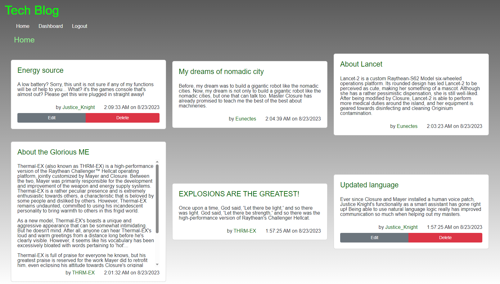
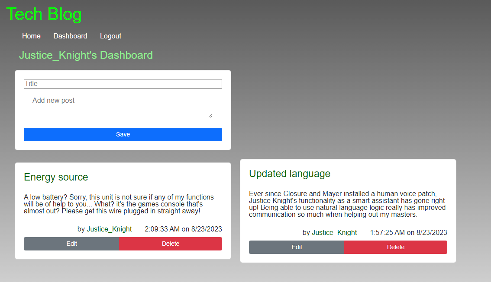

# Tech-Blog

## Description/Link
A blog for technology. Users can post and comment their opinions on technology.

Link to deployed site: https://thrmex-1e6a18238950.herokuapp.com/

## Table of Contents
- [Installation](#installation)
- [Usage](#usage)
- [License](#license)
- [Contributing](#contributing)
- [Contact](#contact)

## Installation
Download code from the GitHub repository. Have Node.js installed. Link to Node.js downloads: https://nodejs.dev/en/download/. Then in the terminal install all the npm packages (liseted under contributing) by inputting npm install. 

The user has to enter mysql information in the .env.EXAMPLE file and change it's name to just .env. This will allow the application to connect with the mysql server. 

The user will then need to source it's database. In the terminal type in mysql -u {username} -p. Enter password and then type in source db/schema.sql and then exit. The database name is blog_db. To create the database tables and preset information input in the terminal npm run seed. The user only needs to source and seeds the database once.

## Usage
On the homepage of the site the user will be able to see everyone's posts. All post and comments display the most recent one first.

If the user is not logged in they cannot see anyone's dashboard. They cannot also create, edit, or delete posts and comments.

The user can login or sign up by clicking the login in the navbar. Once logged in the user will be taken to their dashboard where they can create their own posts. To create a post it must have a title and contents. The user can only make posts on their own dashboard and the only way to comment is to click on an indvidual post. To click on an individual post thye need to clik the title of the post. 

If the user is idle for one hour their session will end and they would need to login again. The user can only log in to another account if they have first logged out.

Screenshot of homepage: 

Screenshot of user dashboard: 

## License
 This application is covered under MIT License.

You can click on the badge for further information.

## Contributing
Bootstrap CSS framework: https://getbootstrap.com/

Npm Packages used:
    Express handlebars: https://www.npmjs.com/package/express-handlebars
    MySQL2: https://www.npmjs.com/package/mysql2
    Sequelize: https://www.npmjs.com/package/sequelize
    Dotenv: https://www.npmjs.com/package/dotenv
    Bycrypt package: https://www.npmnpmjs.com/package/bcrypt
    Express-session: https://www.npmjs.com/package/express-session
    Connect-sequelize: https://www.npmjs.com/package/connect-session-sequelize

## Contact
GitHub profile: https://github.com/CYMcolor
